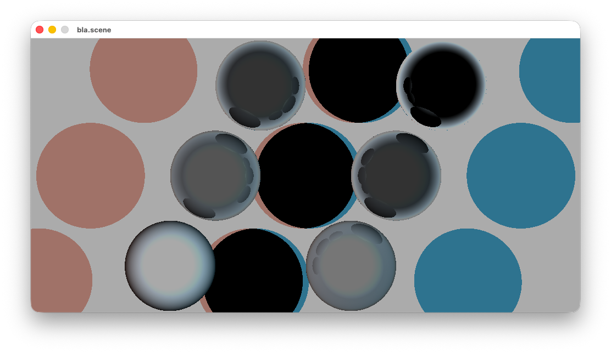
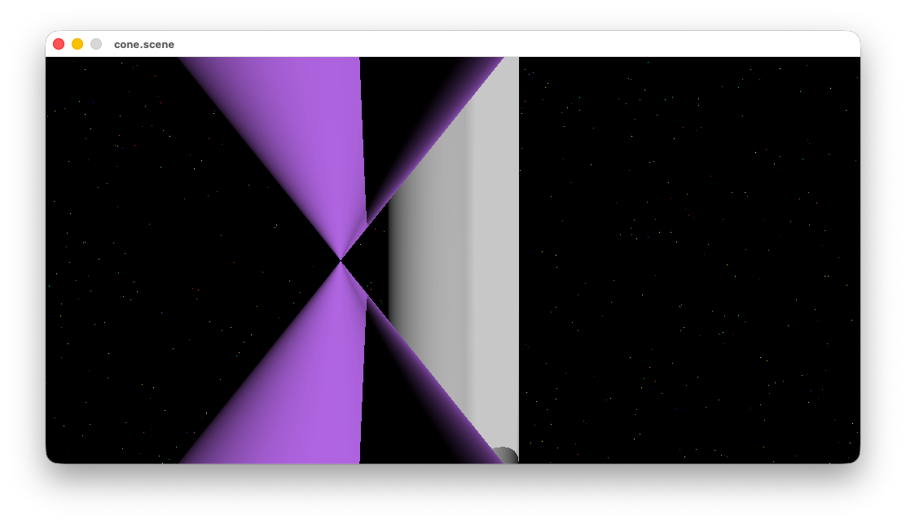
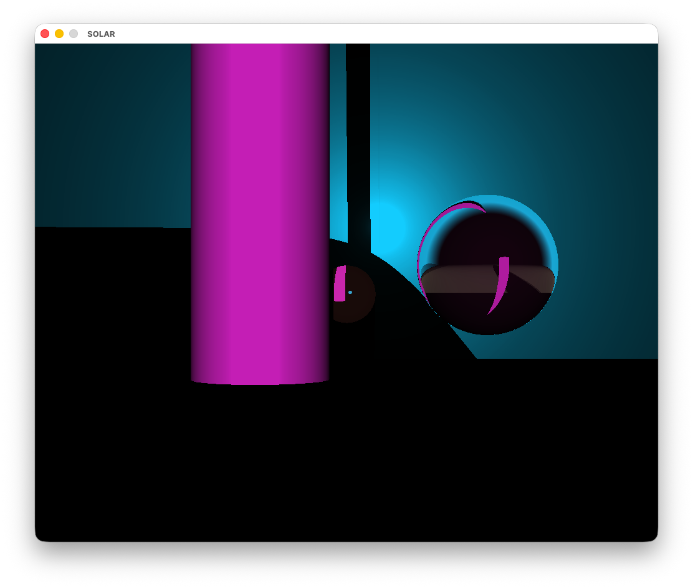
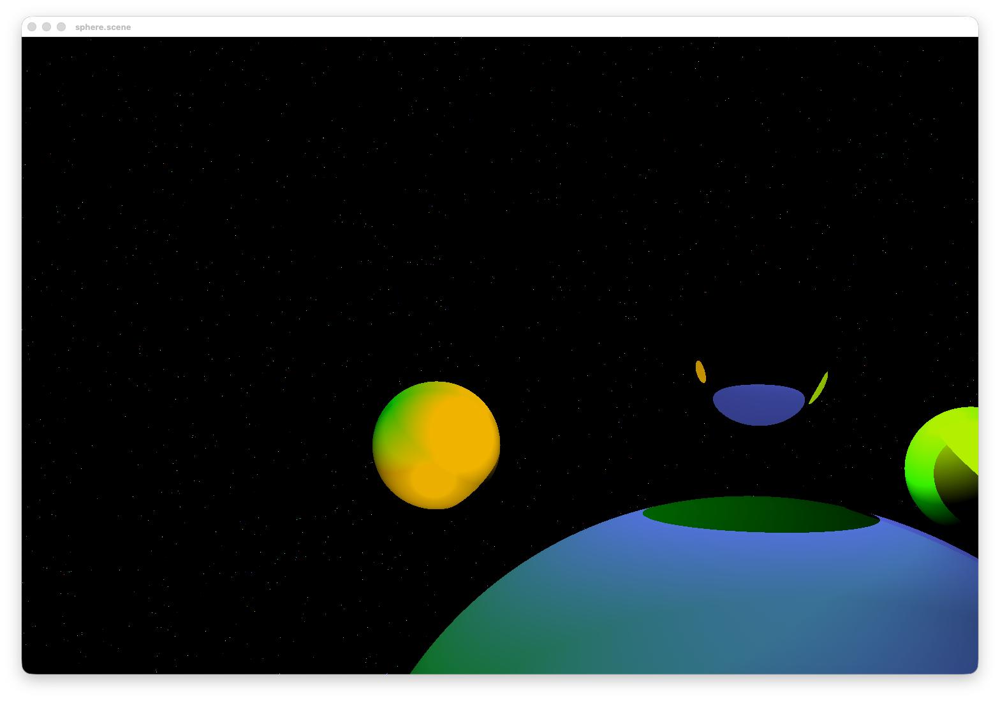
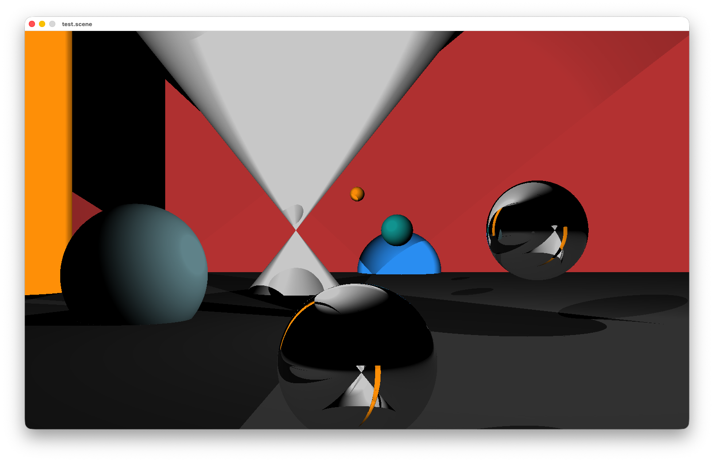
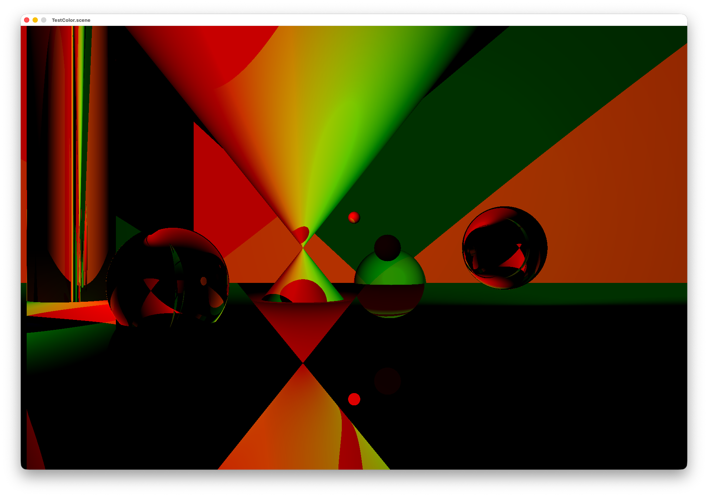

# Raytracer (RTv1)

A small C raytracer project using MiniLibX.

It parses a scene description from standard input, computes ray/object intersections,
shading (Lambert/specular), and simple reflection, then displays the rendered image
in a window.

## Project Purpose

This project is an educational raytracer focused on:

- Basic geometric primitives: sphere, plane, cylinder, cone
- Light sources and lighting model
- Reflection coefficient per object
- Scene parsing from a text format
- Real-time display with MiniLibX








## Features

- Supported objects:
  - `sphere`
  - `plan` (plane)
  - `cylinder`
  - `cone`
  - `light`
- Scene and object validation with explicit parser errors
- Keyboard and mouse interaction in the render window
- Optional debug/help overlay in-window

## Repository Layout

- `srcs/`: raytracer source code
- `includes/`: headers
- `map/`: example scene files
- `libprintf/`: custom printf + libft dependency
- `minilibx_macos/`: MiniLibX (expected local folder on macOS)
- `Makefile`: build entrypoint

## Requirements

### macOS

- `clang`/`cc`
- Xcode Command Line Tools
- MiniLibX available in `minilibx_macos`

### Linux

- `cc`
- X11 development libraries (`libX11`, `libXext`)
- MiniLibX (Linux variant)

## Setup MiniLibX

If `minilibx_macos/` is missing, clone it at project root:

```bash
git clone --depth 1 https://github.com/dannywillems/minilibx-mac-osx minilibx_macos
```

You can override the MiniLibX path at build time:

```bash
make MLX_DIR=/absolute/or/relative/path/to/minilibx
```

## Build

From project root:

```bash
make
```

Useful targets:

```bash
make clean
make fclean
make re
```

## Run

Important: the parser reads from stdin (not from argv), so run with input redirection.

Example:

```bash
./RT < map/sphere.scene
```

Other scenes:

```bash
./RT < map/cone.scene
./RT < map/cylindre.scene
./RT < map/testcolor.scene
./RT < map/test.scene
```

## Python Scene Parser

A Python parser/validator is available for inspecting scene files:

```bash
./tools/scene_parser.py map/sphere.scene
```

It prints the parsed scene as JSON. It can also read from stdin:

```bash
./tools/scene_parser.py < map/sphere.scene
```

A stricter linter is available to validate scene/map files:

```bash
./tools/scene_lint.py map/sphere.scene
./tools/scene_lint.py
```

Without arguments, it checks every `map/*.scene` and `map/*.map` file.

## Controls

In the render window:

- `Esc` or `q`: quit
- `h`: toggle help overlay
- Left mouse click: debug info for the clicked pixel/object

## Scene File Format

A scene file is split into 2 sections:

1. `##scene` ... `#end_env`
2. `##objects` ... `##end`

### Scene Header

Required keys:

- `#name` (string)
- `#window` followed by width then height
- `#cam` followed by x, y, z

Example:

```text
##scene
#name
my.scene
#window
1500
1000
#cam
0
0
0
#end_env
```

### Objects Section

Each object starts with:

```text
#type
<object_name>
```

And ends with:

```text
#end_object
```

Supported object names:

- `sphere`
- `plan`
- `cylinder`
- `cone`
- `light`

Common/expected keys by object:

- `sphere`: `#radius`, `#origin` (x y z), `#color`, optional `#ref`
- `plan`: `#const`, `#origin` (normal x y z), `#color`, optional `#ref`
- `cylinder`: `#origin`, `#dir`, `#const`, `#color`, optional `#ref`
- `cone`: `#origin`, `#dir`, `#const`, `#color`, optional `#ref`
- `light`: `#origin`, `#color`

`#color` format is hexadecimal (example: `0xFF7260`).

## Testing

### 1) Build test

```bash
make re
```

Expected result: binary `RT` is produced.

### 2) Scene smoke tests

Run all example scenes one by one:

```bash
./RT < map/sphere.scene
./RT < map/sphere2.scene
./RT < map/cone.scene
./RT < map/cylindre.scene
./RT < map/testcolor.scene
./RT < map/test.scene
```

### 3) Parser error-path tests

You can feed invalid files from `libprintf/test-errors/` (or malformed scene files)
to confirm robust error handling.

## Troubleshooting

### `fatal error: 'mlx.h' file not found`

- Ensure MiniLibX is present in `minilibx_macos/`
- Or set `MLX_DIR` explicitly:

```bash
make MLX_DIR=minilibx_macos
```

### Linker errors with `-lmlx`

- Verify MiniLibX was built
- Rebuild from scratch:

```bash
make fclean
make
```

### Program exits immediately with scene errors

- Confirm your input file follows the exact expected tags/ordering
- Check that required blocks exist: `##scene`, `##objects`, `##end`

## Notes

- This project uses custom `libft` and `ft_printf` from `libprintf/`.
- The build currently includes AddressSanitizer flags (`-fsanitize=address -g3`) in `Makefile`.
- On modern macOS, OpenGL deprecation warnings from MiniLibX are expected.
